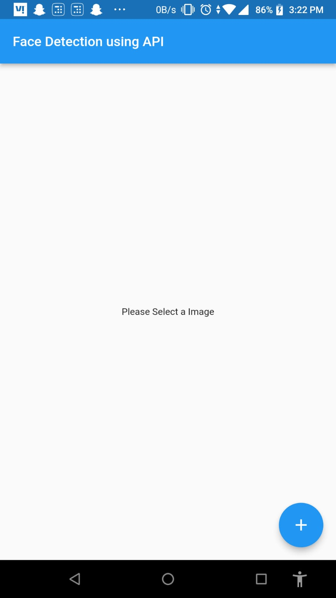
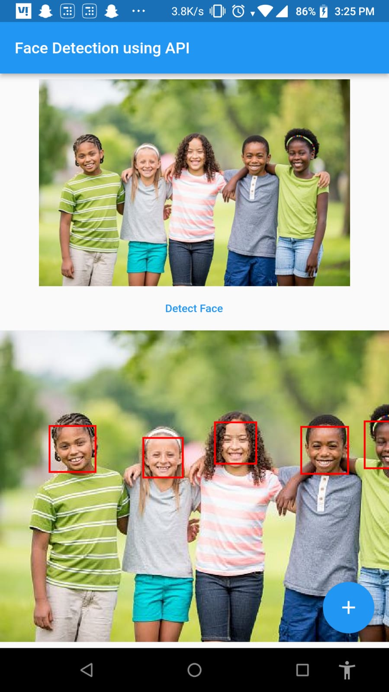
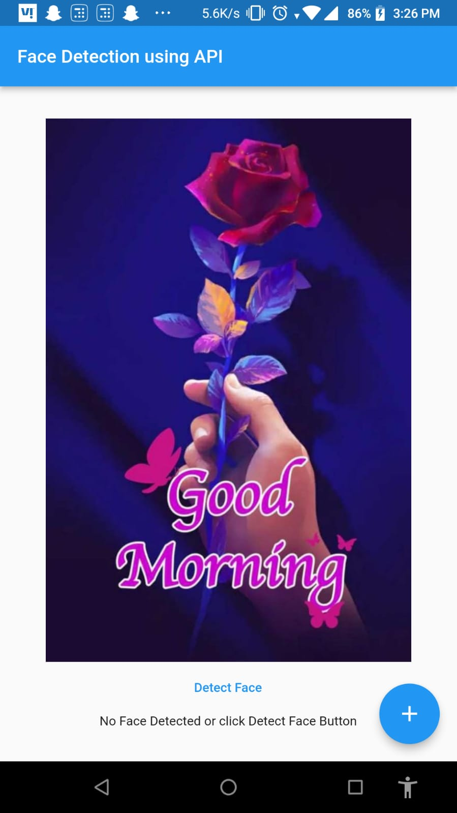

# Flutter Face Detection

### Face Detection in Mobile App using Python, Flask, NGROK, and Flutter

## Medium
You can check my <a href="https://agnelselvan.medium.com/face-detection-in-mobile-app-using-python-flask-and-flutter-363cb6d2ab01">medium</a> blog to be more clear regarding this project.

## Getting Started

#### Download this Flutter Project

* Navigate to *face_reco_python* directory and run
```python
    python3 app.py
```

* Please make sure you have ngrok installed if not download it from <a href="https://ngrok.com/download">Officia Website</a>

* Once ngrok installed run the command in your terminal
```
    ngrok http 5000
```

* Once done you will get a URL from ngrok. Copy that url.
  
* Paste it in your main.dart file on line 108
  
* and run your flutter project
```dart
    flutter run
```

## Outputs




